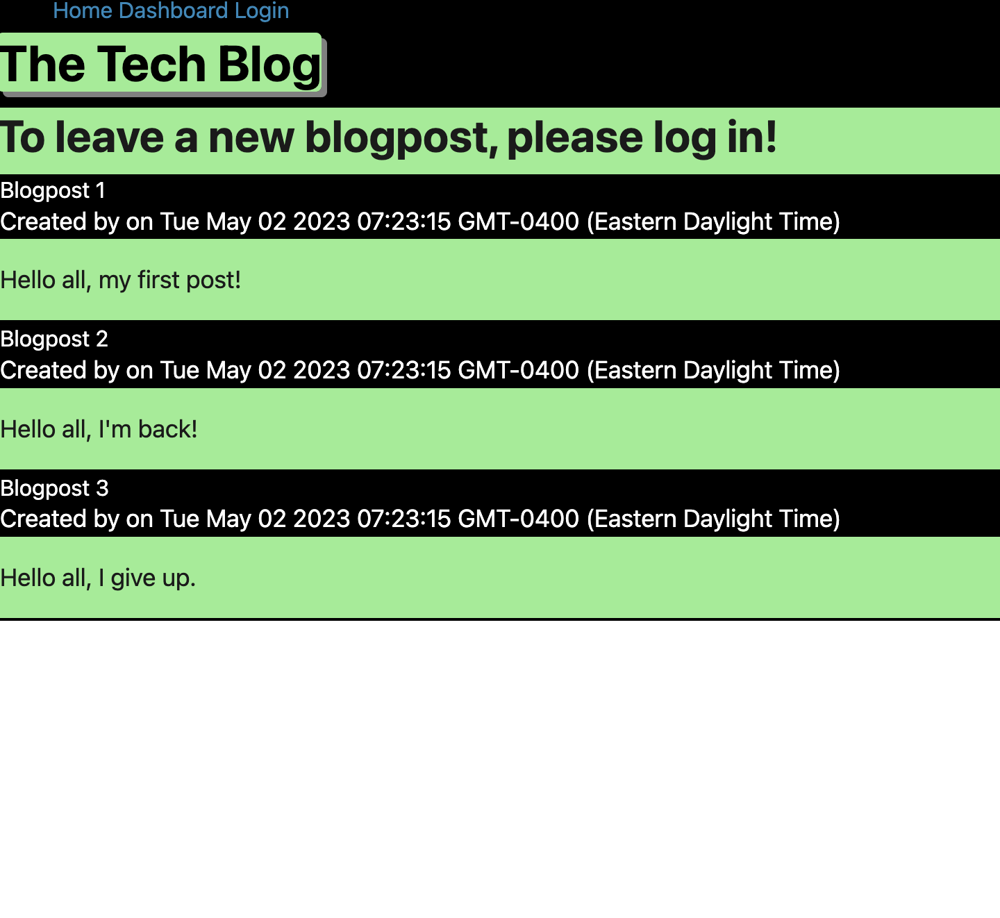

# Tech-Blog
This project was incredibly daunting and I am afraid I was
unsuccessful in completing it.
Functionally, the website is a blog where, upon logging in,
you can make posts and check your dashboard to see the posts
you've made. However I was unsuccessful in completing the functionality,
outside of logging in and rendering the homepage.
Initially I set up the folders and set about making the models
and the server.js file and connection.js files, which went smoothly.
The bulk of my time was spent making the various routes and then
working with handlebars to create a decent looking webpage.
Most of my efforts with the routes were a struggle, but after much effort
I got the webpage to load.

[link](https://infinite-journey-41929.herokuapp.com/)

